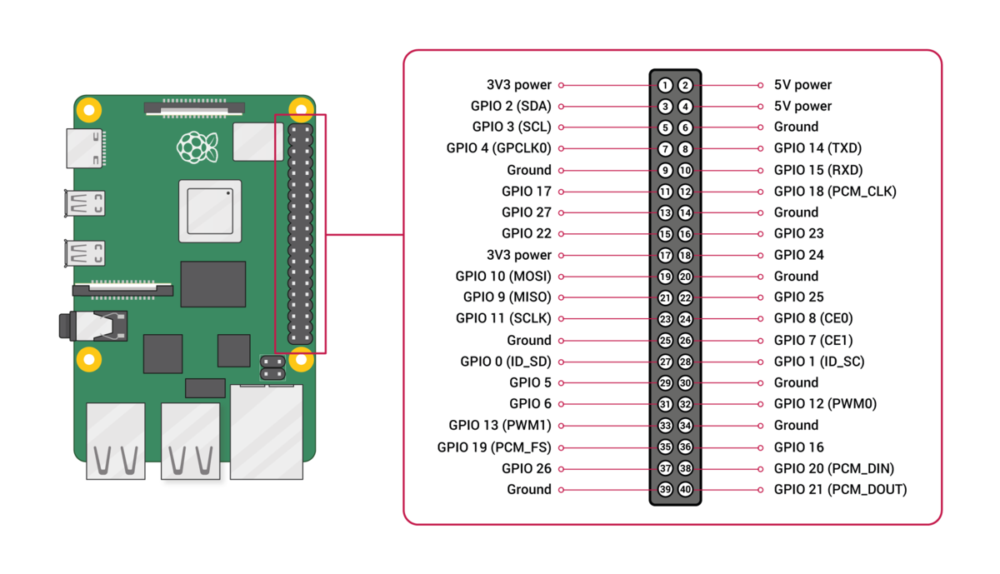

# 유저 공간에서 i2c-dev를 이용해 CLCD에 문자열 출력

## BCM2711 pinout


> GPIO2(SDA1) &rarr; SDA <br>
GPIO3(SCL1) &rarr; SCL

## lcd 모듈 주소 확인

```bash
pi@pi24:~ $ ls /dev/i2c-1
/dev/i2c-1
pi@pi24:~ $ sudo i2cdetect -y 1
     0  1  2  3  4  5  6  7  8  9  a  b  c  d  e  f
00:                         -- -- -- -- -- -- -- --
10: -- -- -- -- -- -- -- -- -- -- -- -- -- -- -- --
20: -- -- -- -- -- -- -- 27 -- -- -- -- -- -- -- --
30: -- -- -- -- -- -- -- -- -- -- -- -- -- -- -- --
40: -- -- -- -- -- -- -- -- -- -- -- -- -- -- -- --
50: -- -- -- -- -- -- -- -- -- -- -- -- -- -- -- --
60: -- -- -- -- -- -- -- -- -- -- -- -- -- -- -- --
70: -- -- -- -- -- -- -- --

```


## BSC1 레지스터 오프셋
> BSC1: 0x7e804000


## 어플리케이션 코드
```c
// i2c_clcd.c : PCF8574 I2C 백팩(HD44780) 유저 공간 테스트
// 빌드: gcc -Wall -O2 i2c_clcd.c -o i2c_clcd -li2c
// 실행: ./i2c_clcd 0x27 "Hello\nWorld"

#include <stdio.h>
#include <stdint.h>
#include <string.h>
#include <unistd.h>
#include <fcntl.h>
#include <errno.h>
#include <stdlib.h>
#include <linux/i2c-dev.h>
#include <sys/ioctl.h>
#include <i2c/smbus.h>

#define I2C_DEV   "/dev/i2c-1"

// ====== 핀 매핑(보편형 A) ======
// P0=RS, P1=RW, P2=EN, P3=BL, P4=D4, P6=D5, P6=D6, P7=D7
#define PIN_RS 0
#define PIN_RW 1
#define PIN_EN 2
#define PIN_BL 3
#define PIN_D4 4
#define PIN_D5 5
#define PIN_D6 6
#define PIN_D7 7

// ====== 다른 백팩이면 이 블록을 사용(B) ======
// P0=RS, P1=RW, P2=EN, P3=D4, P4=D5, P5=D6, P6=D7, P7=BL
// #define PIN_RS 0
// #define PIN_RW 1
// #define PIN_EN 2
// #define PIN_D4 3
// #define PIN_D5 4
// #define PIN_D6 5
// #define PIN_D7 6
// #define PIN_BL 7

static uint8_t bl_on = 1; // 백라이트 ON 유지

static int pcf8574_write(int fd, uint8_t v)
{
    if (bl_on) v |= (1u << PIN_BL);
    return i2c_smbus_write_byte(fd, v);
}

static void pulse_en(int fd, uint8_t v)
{
    pcf8574_write(fd, v | (1u << PIN_EN));
    usleep(1);           // EN High >= ~1us
    pcf8574_write(fd, v & ~(1u << PIN_EN));
    usleep(50);          // 데이터 셋업 시간
}

static void write4(int fd, uint8_t nibble, int rs)
{
    uint8_t v = 0;
    if (rs) v |= (1u << PIN_RS);      // 데이터 모드
    // RW는 항상 0(쓰기)
    if (nibble & 0x1) v |= (1u << PIN_D4);
    if (nibble & 0x2) v |= (1u << PIN_D5);
    if (nibble & 0x4) v |= (1u << PIN_D6);
    if (nibble & 0x8) v |= (1u << PIN_D7);
    pulse_en(fd, v);
}

static void send8(int fd, uint8_t b, int rs)
{
    write4(fd, b >> 4, rs);
    write4(fd, b & 0x0F, rs);
}

static void cmd(int fd, uint8_t c)  { send8(fd, c, 0); }
static void data8(int fd, uint8_t d){ send8(fd, d, 1); }

static void lcd_init(int fd)
{
    usleep(50000);                 // 전원 안정화 ≥40ms
    // 4-bit 초기화 시퀀스
    write4(fd, 0x3, 0); usleep(5000);
    write4(fd, 0x3, 0); usleep(150);
    write4(fd, 0x3, 0); usleep(150);
    write4(fd, 0x2, 0);            // 4-bit 진입

    cmd(fd, 0x28);                 // 4-bit, 2라인, 5x8
    cmd(fd, 0x0C);                 // 디스플레이 ON, 커서/블링크 OFF
    cmd(fd, 0x06);                 // 엔트리 모드: 인크리먼트, 쉬프트 없음
    cmd(fd, 0x01); usleep(2000);   // 클리어(≥1.52ms)
}

static void set_cursor(int fd, int row, int col)
{
    static const uint8_t base[] = {0x00, 0x40, 0x14, 0x54}; // 16x2/20x4 호환
    uint8_t addr = base[row & 3] + (uint8_t)col;
    cmd(fd, 0x80 | addr);
}

static void print_text(int fd, const char* s)
{
    int col = 0, row = 0;
    for (; *s; ++s) {
        if (*s == '\n') { row++; col = 0; set_cursor(fd, row, 0); continue; }
        data8(fd, (uint8_t)*s);
        if (++col >= 16) { row++; col = 0; set_cursor(fd, row, 0); }
        usleep(40); // 일반 데이터 처리 ≥37us
    }
}

int main(int argc, char** argv)
{
    int addr = 0x27;
    const char* msg = "Hello World";
    if (argc >= 2) addr = (int)strtol(argv[1], NULL, 0);
    if (argc >= 3) msg  = argv[2];

    int fd = open(I2C_DEV, O_RDWR);
    if (fd < 0) { perror("open /dev/i2c-1"); return 1; }
    if (ioctl(fd, I2C_SLAVE, addr) < 0) { perror("ioctl I2C_SLAVE"); return 1; }

    // 백라이트 토글로 BL 핀맵 빠르게 확인하고 싶으면 아래 주석 해제
    // bl_on = 1; pcf8574_write(fd, 0); usleep(200000);
    // bl_on = 0; pcf8574_write(fd, 0); usleep(200000);
    // bl_on = 1;

    lcd_init(fd);
    set_cursor(fd, 0, 0);
    print_text(fd, msg);
    close(fd);
    return 0;
}
```


